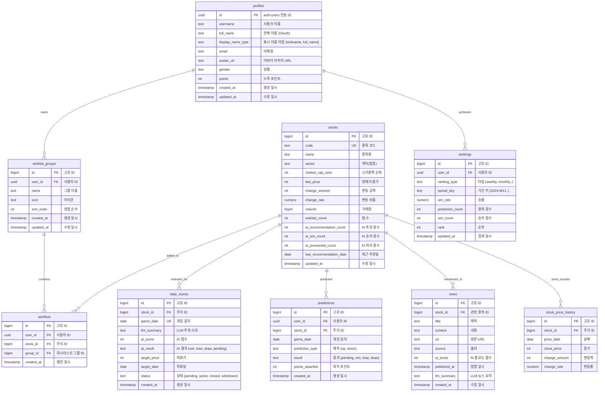

# 주식 예측 리그 ERD (Entity Relationship Diagram)

```mermaid
erDiagram
    profiles {
        uuid id PK "auth.users 연동 ID"
        text username "사용자 이름"
        text full_name "전체 이름 (OAuth)"
        text display_name_type "표시 이름 타입 (nickname, full_name)"
        text email "이메일"
        text avatar_url "아바타 이미지 URL"
        text gender "성별"
        int points "누적 포인트"
        timestamp created_at "생성 일시"
        timestamp updated_at "수정 일시"
    }
    stocks {
        bigint id PK "고유 ID"
        text code UK "종목 코드"
        text name "종목명"
        text sector "섹터(업종)"
        int market_cap_rank "시가총액 순위"
        int last_price "현재가/종가"
        int change_amount "변동 금액"
        numeric change_rate "변동 비율"
        bigint volume "거래량"
        int wishlist_count "찜 수"
        int ai_recommendation_count "AI 추천 횟수"
        int ai_win_count "AI 승리 횟수"
        int ai_processed_count "AI 처리 횟수"
        date last_recommendation_date "최근 추천일"
        timestamp updated_at "수정 일시"
    }
    wishlist_groups {
        bigint id PK "고유 ID"
        uuid user_id FK "사용자 ID"
        text name "그룹 이름"
        text icon "아이콘"
        int sort_order "정렬 순서"
        timestamp created_at "생성 일시"
        timestamp updated_at "수정 일시"
    }
    wishlists {
        bigint id PK "고유 ID"
        uuid user_id FK "사용자 ID"
        bigint stock_id FK "주식 ID"
        bigint group_id FK "위시리스트 그룹 ID"
        timestamp created_at "찜한 일시"
    }
    daily_stocks {
        bigint id PK "고유 ID"
        bigint stock_id FK "주식 ID"
        date game_date UK "게임 일자"
        text llm_summary "LLM 추천 사유"
        int ai_score "AI 점수"
        text ai_result "AI 결과 (win, lose, draw, pending)"
        int target_price "목표가"
        date target_date "목표일"
        text status "상태 (pending, active, closed, withdrawn)"
        timestamp created_at "생성 일시"
    }
    predictions {
        bigint id PK "고유 ID"
        uuid user_id FK "사용자 ID"
        bigint stock_id FK "주식 ID"
        date game_date "게임 일자"
        text prediction_type "예측 (up, down)"
        text result "결과 (pending, win, lose, draw)"
        int points_awarded "획득 포인트"
        timestamp created_at "생성 일시"
    }
    news {
        bigint id PK "고유 ID"
        bigint stock_id FK "관련 종목 ID"
        text title "제목"
        text content "내용"
        text url "원문 URL"
        text source "출처"
        int ai_score "AI 중요도 점수"
        timestamp published_at "발행 일시"
        text llm_summary "LLM 뉴스 요약"
        timestamp created_at "수집 일시"
    }
    rankings {
        bigint id PK "고유 ID"
        uuid user_id FK "사용자 ID"
        text ranking_type "타입 (weekly, monthly..)"
        text period_key "기간 키 (2024-W12..)"
        numeric win_rate "승률"
        int prediction_count "참여 횟수"
        int win_count "승리 횟수"
        int rank "순위"
        timestamp updated_at "집계 일시"
    }
    stock_price_history {
        bigint id PK "고유 ID"
        bigint stock_id FK "주식 ID"
        date price_date "날짜"
        int close_price "종가"
        int change_amount "변동액"
        numeric change_rate "변동률"
    }
    profiles ||--o{ wishlist_groups : "owns"
    profiles ||--o{ rankings : "achieves"
    wishlist_groups ||--o{ wishlists : "contains"
    stocks ||--o{ daily_stocks : "selected_for"
    stocks ||--o{ predictions : "predicted"
    stocks ||--o{ news : "mentioned_in"
    stocks ||--o{ wishlists : "added_to"
    stocks ||--o{ stock_price_history : "price_records"
```
